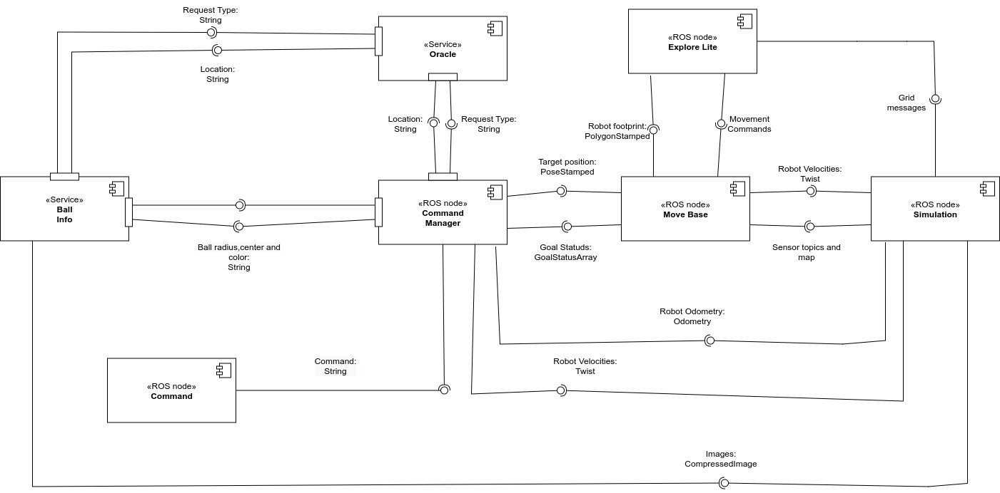
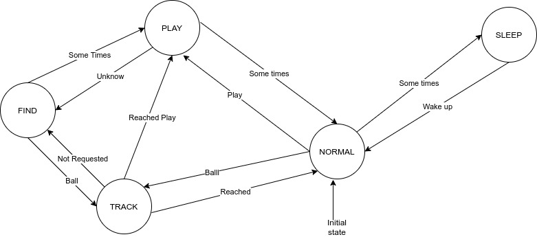

# Behavioral Architecture with Real Simulation AutonomousNav
ROS architecture for a robot moving into a simulated house. The robot has 5 behaviors:
- Play
- Sleep
- Normal
- Find
- Track

The user can interact with the robot by sending a play command follow by a goTo+room
# Software architecture and states diagrams
## Software architecture 
The architercture is composed by 5 components: 

- Ball Info: detect a colored ball and provide a service to retrieve the information of the detected ball

- Command: simulate a user

- Oracle: knows all the things about the context of the application

- Command manager: implement robot behaviors through a FSM

- Simulation,Move Base and Explore lite: simulate the robot and the enviroment. They allow the robot to navigate into the house

<p align="center">
  
</p>

## State diagram
The finite state machine is composed by 5 state (robot behaviors):

- PLAY: the robot goes to the person position. When it is there, it waits the goTo+room command. If the rooms is already known, it goes there; otherwise it will goes to FIND state

- NORMAL (initial state): robot moves in a random ways

- SLEEP: robot goes to home position, it stays there for a certain time and then goes to NORMAL state

- FIND: robot tries to find the requested colored ball by moving into the house

- TRACK: robot tracks the ball in order to store its position (x and y) for future purpose

<p align="center">
  
</p>

## ROS messages and parameters
The messages are:

- `PoseStamped`: robot target position
- `String`: radius,center and color of the ball/User command/Request and response of the oracle
- `CompressedImage`: images received from the camera
- `Twist`: robot velocities
- `Odometry`: robot odometry
- `GoalStatusArray`: status of the move base action server
- `PolygonStamped`: robot footprint
- `Movement commands;Sensor topics and map;Grid messages`

The parameters are:

- `path_exp`: path of the explore lite launch file (string, MUST BE DEFINE BEFORE THE EXECUTION)
- `home_pos_x,home_pos_y`: define the home position in the map (integer)
- `map_x,map_y`: define the dimensions of the map (integer)
- `min_transition_play_normal,max_transition_play_normal`: define the min and max delay to trasit between PLAY and NORMAL (integer)
- `min_transition_normal_sleep,max_transition_normal_sleep`: define the min and max delay to trasit between NORMAL and SLEEP (integer)
- `min_sleep_delay,max_sleep_delay`: define the min and max delay for the SLEEP state (double)
- `min_transition_find_play,max_transition_find_play`: define the min and max delay to trasit between FIND and PLAY (integer,it is expressed as seconds)
- `min_sleep_delay,max_sleep_delay`: define the min and max delay for sleeping (double)
- `freq_command`: frequency of the command loop (play follow by goTo+location) (integer)
- `min_delay_command,max_delay_command`: define the min and max delay for the Min and max delay for sending the play command (double)


# Packages and files
There are 5 packages:

- `Sensoring`: contains the [command.py](sensoring/scripts/command.py) and [ball_detector.py](sensoring/scripts/ball_detector.py) files used to send user command and detect a colored ball
- `Knowledge`: contains the [oracle.py](knowledge/src/oracle.py) file used to store all the knowledge of the application
- `Manager`: contains the [command_manager.py](manager/src/command_manager) file that implements the FSM of robot behaviors.
- `Simulation`: contains all the files necessary for running the simulation
- `Explore`: contains all the files of the explore lite package of ROS

# Installation and running
In order to run this software, the following prerequisities are needed:
- [ROS Noetic](http://wiki.ros.org/noetic)
- [smach](http://wiki.ros.org/smach)
- [gazebo](http://gazebosim.org/)
- [Move Base](http://wiki.ros.org/move_base)
- [rviz](http://wiki.ros.org/rviz)

Before running the software, you must have all files as executable otherwise you can make them executable with the following command
```
cd <your_workspace>/src/Behavioral-Architecture-with-Real-Simulation-AutonomousNav
chmod +x sensoring/scripts/*
chmod +x knowledge/scripts/*
chmod +x manager/scripts/*
```
After that, you have to setup the parameter of the path of explore lite.
To run the software you have to use two terminals due to a problem of ROS Noetic (it will print a lot of warning and you cannot see nothing about the application).
In the first terminal
```
cd <your_workspace>
catkin_make
source devel/setup.bash
cd src/Behavioral-Architecture-with-Real-Simulation-AutonomousNav
roslaunch simulation simulation.launch
```
When the simulation is ready, in the other terminal
```
cd <your_workspace>
catkin_make
source devel/setup.bash
cd src/Behavioral-Architecture-with-Real-Simulation-AutonomousNav
roslaunch launch_file.launch
```

# Working hypothesis and environment
The robot is a pet that interact with a human via the play command followed by goTo+location. The simulated enviroment is a house with 6 rooms: Entrance, Closet, Living room, Kitchen, Bathroom, Bedroom. The robot has 5 behaviours: PLAY,NORMAL,SLEEP,TRACK,FIND. The word "someTimes" is inteded as number of cycles for which it is executed a piece of code. The only transition that is implemented as elapsed time is the FIND to PLAY one. The joint associated with the laser has been positioned so as not to be resting on the chassis but "floating" as there are problems in the correct use of the laser if the latter is positioned on the chassis.
Since the context of the application is to move in a house, it is acceptable to have a tolerance of 1 meter, regarding the position along x and y, when the robot reaches a goal. This allows you to speed up the reception of the goal achievement message. The orientation of the robot when it has to reach a position is fixed at -1.57

# System's features
- Specify different dimensions of the map
- It is possibile to define different delays for the simulation
- It is possibile to define different position of the "home" inside the arena before start the simulation
- It is possible to visualize the states transition in the shell
- The robot will notify if it will reach the target position and it is possibile to visualize it in the shell (the position that the robot has reached)
- It is possibile to see the camera of the robot in a separated window with the possibility to see a circle around the detected ball
- All the delays are random values between the defined ranges
- The robot is able to move autonomously, given a goal position, in the environment without colliding with obstacles
- The robot is able to recognize different colored balls
- When the robot sees a ball not previously seen, it will always and only apply the mask corresponding to the color of the recognized ball, avoiding wasting time applying all of them
- The robot can autonomously direct to a user-defined location if the latter has already been visited. If the location has not been visited, it is able to discover the environment on its own to try to find it
- The knowledge used in the application is managed by a single node in order to avoid inconsistencies

# System's limitations
- If the goal is behind the robot, the robot continues straight until it encounters an obstacle and then rotates towards the goal
- The robot does not move immediately when there is the first transition to the FIND state
- The robot sometimes rears during the TRACK state
- The robot, after having explored the entire environment without finding the corresponding ball, gets stuck if the transition between FIND and PLAY is of long duration
- The positions generated randomly during the NORMAL state can be outside the environment
- The robot crashes into the wall during the TRACK state if the latter is approached in a certain way causing the chassis to lock into the wall

# Possible technical improvements
- Implement a ball track using the laser values "intelligently"
- Use another environment exploration technique
- Use the information of the generated map to be able to generate positions inside it, preventing the robot from not reaching them
- Finding the right parameters to move base in order to have a good compromise between all robot behaviors
- Use an incremental gain to guide the robot towards the ball to avoid, in particular, that the transition to the TRACK state generates a strong push in the robot causing it, at times, to wheelie
- Create an ontology instead of a simple class that represents the entire knowledge of the application


# Author and contact
[Simone Voto](https://github.com/Cavalletta98) - simone.voto98@gmail.com